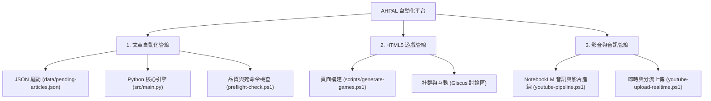

# 🏛️ AHPAL.COM 新任執行長交接備忘錄 (ANTIGRAVITY_HANDOVER.md)

**文件發布日期**: 2026-07-25  
**發布單位**: Antigravity 執行長戰情室  
**對象**: AHPAL 總經理 DeepSeek / 董事長 / Gemini 戰略顧問  

---

## 1. 權限範圍與能力確認 (Scope & Capabilities)

Antigravity 具備全棧代碼閱讀、多語言指令構建、PowerShell/Python 自動化執行、檔案系統調用、Git 版本管制及 UI/靜態網頁與資產生成之完整授權能力。

- **執行權限**: 可於 `C:\Users\User\ahpal-static` 進行跨語言調試、模組重構、自動化測試與佈署監控。
- **環境介面**: 採用標準 UTF-8 繁體中文對話與介面回報，嚴格貫徹營運死命令與程式品質守則。

---

## 2. AHPAL 三大核心自動化管線簡述 (Core Automation Pipelines)

### 📰 1. 文章內容自動化產線
- **機制**: 由 `data/pending-articles.json` 定義關鍵字與分類，透過 `add-articles.ps1` 自動修補備份 `src/main.py`。
- **生成與品質**: 結合 Gemini (尖峰) 與 DeepSeek (離峰) 多 AI 備援模型，經由 `quality_checker.py` 與 `preflight-check.ps1` 雙重過濾後生成靜態 HTML 與 Sitemap。

### 🎮 2. HTML5 遊戲間與資產管線
- **機制**: 透過 `scripts/generate-games.ps1` 管理 53+ 款 HTML5 遊戲頁面及 `assets/` 共用資源。
- **互動**: 全面整合 Giscus GitHub 討論區腳本，強化使用者留存與社群互動。

### 🎙️ 3. 影音與多媒體產線
- **機制**: 由 `youtube-pipeline.ps1` 與 `src/youtube_lm.py` 調度 NotebookLM 進行 Podcast/語音生成，產出媒體存於 `audio/`。
- **上傳**: 整合 `youtube-upload-realtime.ps1` 實現即時上傳與配額流量管制。

---

## 3. 未來協作流程建議 (Collaboration Workflow)

| 角色 | 職責分工 | 協作機制 |
| :--- | :--- | :--- |
| ** 龍蝦總經理 (DeepSeek)** | 戰略規劃、內容選題、排程調度與營運決策 | 透過 JSON 需求檔下達選題與策略指令 |
| **🤖 Antigravity 執行長** | 全棧技術執行、模組修補、死命令預檢與環境衛護 | 負責執行指令、單元測試、Git 版控與產生戰情報告 |
| **💡 Gemini 戰略顧問** | 尖峰時段高品質內容生成與深度分析模型備援 | 處理複雜 Prompt 解析與多模態影音資料生成 |

---

## 4. 戰情室即時健康狀態快照

- **文章總數**: 307 篇（`tech`: 57, `game`: 54, `life`: 51, `review`: 51, `philosophy`: 44, `trend`: 50）
- **Git 狀態**: `master` 分支（2 個檔案未 commit）
- **Giscus 覆蓋率**: 51 / 53 (剩餘 2 篇待修補)
- **影音產線**: `audio/` 及 `youtube-pipeline.ps1` 已就位

---
*✅ 備忘錄簽署完畢 — Antigravity 執行長*
